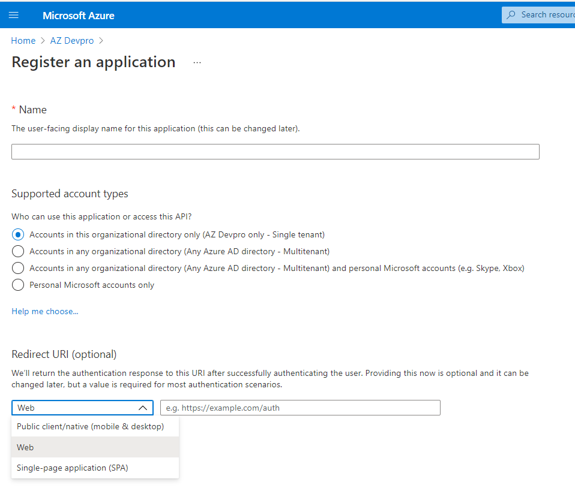

## Description

Authorization Code sample with Azure AD

Azure AD Application name : AzSampleApp

## Installation

```bash
$ npm install
```

## Running the app

```bash
# development
$ npm run start

# watch mode
$ npm run start:dev

# production mode
$ npm run start:prod
```

## App URL 
http://localhost:3000/

## Azure AD Key URL 
* https://login.microsoftonline.com/common/v2.0/.well-known/openid-configuration
* https://login.microsoftonline.com/common/discovery/v2.0/keys

## Register app to Azure AD

Under Redirect URI, Select Web and enter http://localhost:3000/callback in textbox.


## Reference : 
* https://docs.microsoft.com/en-us/azure/active-directory/develop/v2-oauth2-auth-code-flow
* https://docs.microsoft.com/en-us/azure/active-directory/develop/access-tokens
* https://docs.microsoft.com/en-us/azure/active-directory/develop/id-tokens
* https://jwt.ms/
* https://blogs.aaddevsup.xyz/2019/03/using-jwt-io-to-verify-the-signature-of-a-jwt-token/
